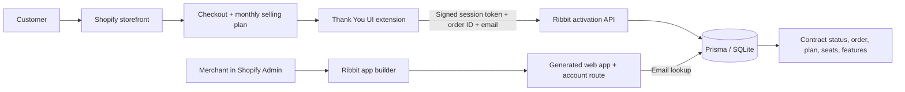

# Ribbit

Ribbit lets Shopify merchants bundle a paid companion web app with a physical
product. A customer buys Lumen Cam with Guard Pro, connects the order to an
email on the Shopify Thank You page, and immediately unlocks a generated
companion app and account dashboard.

## Live demo

- Storefront: https://sidecar-lumen.myshopify.com
- Store password: provide privately to judges in the submission form
- Demo account: `demo@lumen.example`
- Repository: https://github.com/Sythersfr/ribbit

The companion-app URL is created by `shopify app dev` and changes with the
development tunnel. Open it from the checkout/Thank You extension or Ribbit's
App builder.

## Core loop

1. Merchant prepares the Lumen Cam + Guard Pro catalog in Ribbit.
2. Customer checks out with hardware plus a `$12/month` selling plan.
3. The Thank You extension sends the authenticated Shopify order ID and chosen
   account email to Ribbit.
4. Ribbit creates one idempotent subscription contract for that order.
5. The customer signs into the generated app with the same email.
6. Every generated app includes an **Account** page showing the real connected
   order reference, plan, billing period, product, seats, and features.

## Quick start

Requirements: Node.js 20+, npm, Shopify CLI, and a Shopify development store.

```bash
git clone https://github.com/Sythersfr/ribbit.git
cd ribbit
npm install
cp .env.example .env
npx prisma db push
npm run dev
```

Press `p` in Shopify CLI to open the embedded app. Run checks with:

```bash
npm run typecheck
npm run lint
npm run build
```

## Environment variables

Shopify CLI injects most values during `shopify app dev`.

```dotenv
SHOPIFY_API_KEY=
SHOPIFY_API_SECRET=
SCOPES=write_products,write_metaobjects,write_metaobject_definitions,read_orders,write_orders,read_publications,write_publications,write_purchase_options
SHOPIFY_APP_URL=
SHOP_CUSTOM_DOMAIN=
```

The optional OpenAI key is entered only when generating an app. It is used for
that request and is never stored. Leaving it blank uses the deterministic demo
generator.

## Architecture



### Tech stack

- Shopify React Router app and App Bridge
- Shopify Admin GraphQL API and selling plans
- Checkout and Thank You UI extensions using Polaris web components
- Theme app extension for the storefront bundle
- React Router 7, React 18, TypeScript, Vite
- Prisma with SQLite for the hackathon demo
- Vercel AI SDK with OpenAI structured output for optional app generation
- Remotion for the product teaser asset

## Reproduce the demo

1. Open Ribbit in Shopify Admin and select **Prepare store catalog**.
2. Open the storefront and choose **Lumen Cam**.
3. Add the camera + Guard Pro bundle and check out.
4. For Shopify test payments use card `1`, any future expiration, and any
   three-digit security code.
5. On the Thank You page, enter the account email and select **Connect my app**.
6. Open Lumen Guardian and sign in with that email.
7. Select **Account** to show the Shopify order reference and subscription data
   pulled into Ribbit.
8. In Shopify Admin, open **App builder**, enter a prompt, and generate another
   app. Its `/account` route is included automatically.

## Data and provenance

- Lumen Cam and Lumen Guard Pro are synthetic hackathon products created by the
  Ribbit catalog seed.
- Prices (`$249` hardware and `$12/month` software), metrics, alerts, seats, and
  feature names are synthetic demonstration data authored for this project.
- `demo@lumen.example` and `RBT-GUARD-9K2P` are synthetic fallback credentials.
- Actual test checkout order IDs and customer-entered account emails come from
  Shopify's development checkout through the authenticated Thank You extension.
- The storefront theme and original placeholder image came from Shopify's
  generated development-store test data.

No production customer dataset is included in this repository.

## Known limitations and next steps

- Email-only sign-in is for the demo; production should use magic links or
  Shopify Customer Account authentication.
- The app uses SQLite and a temporary Shopify CLI tunnel.
- Shopify protected-order access is not approved, so account activation happens
  securely in the Thank You extension instead of polling the Orders API.
- The development-store checkout block must be enabled in the checkout editor.
- Next steps: deploy to a permanent host, use Postgres, add billing lifecycle
  webhooks after protected-data approval, encrypt merchant secrets, and add
  automated integration tests.

## Team

- **Nic — Product, design, and full-stack engineering**
  Contact: [@Sythersfr on GitHub](https://github.com/Sythersfr)

## Submission write-up

Physical-product merchants increasingly ship connected hardware, but turning
that purchase into recurring software revenue usually requires separate billing
systems, entitlement infrastructure, and a custom customer app. Small teams
often cannot justify that integration work, so valuable companion experiences
never launch.

Ribbit is an app platform for Shopify merchants who want to bundle software with
hardware. In our demo, a shopper buys Lumen Cam together with Guard Pro, a
monthly subscription for intelligent alerts and cloud history. A checkout
extension connects the completed Shopify order to a customer email, while
Ribbit creates an idempotent contract that controls access. The customer then
opens a generated companion web app, signs in with the checkout email, and sees
an account page populated with the connected order, active plan, billing
period, seats, and included features.

For merchants, Ribbit also includes a prompt-based builder that produces a
branded web-app shell without deploying arbitrary generated code. This
demonstrates a reusable path from one-time commerce to recurring customer value:
sell the product, activate software automatically, and give every buyer a
purpose-built account experience. With production hosting, stronger
authentication, and approved lifecycle webhooks, Ribbit could become the
done-for-you subscription and companion-app layer for connected-product brands.

See [SUBMISSION.md](./SUBMISSION.md) for the recording script and final form
answers.
